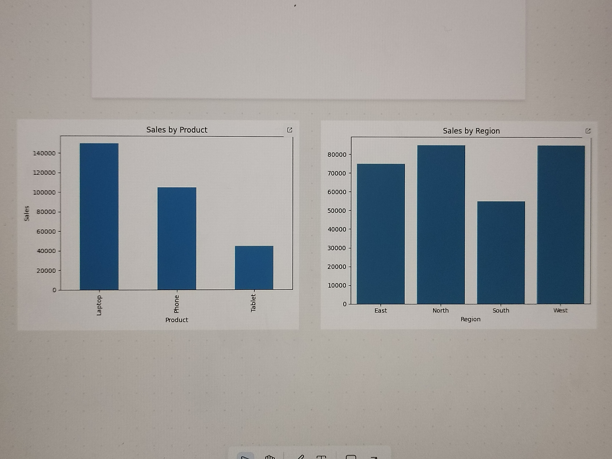

# 📊 Sales Data Analysis using Python

## 📌 Project Overview

This project analyzes sales data to find trends and insights using Python.

## 🛠️ Technologies Used

* Python
* Pandas
* Matplotlib
* Seaborn

## 📁 Files

* analysis.py
* sales_data.csv

## 🚀 How to Run

1. Install libraries:
   pip install pandas matplotlib seaborn

2. Run:
   python analysis.py
   
   ## 📌 Key Insights

* Identified the top-selling product from the dataset
* Found the region with highest sales
* Calculated total sales revenue

These insights help businesses make data-driven decisions.

## 📸 Output

## 👤 Author

Rakesh

